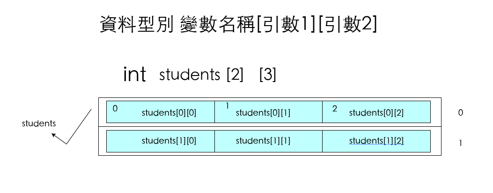
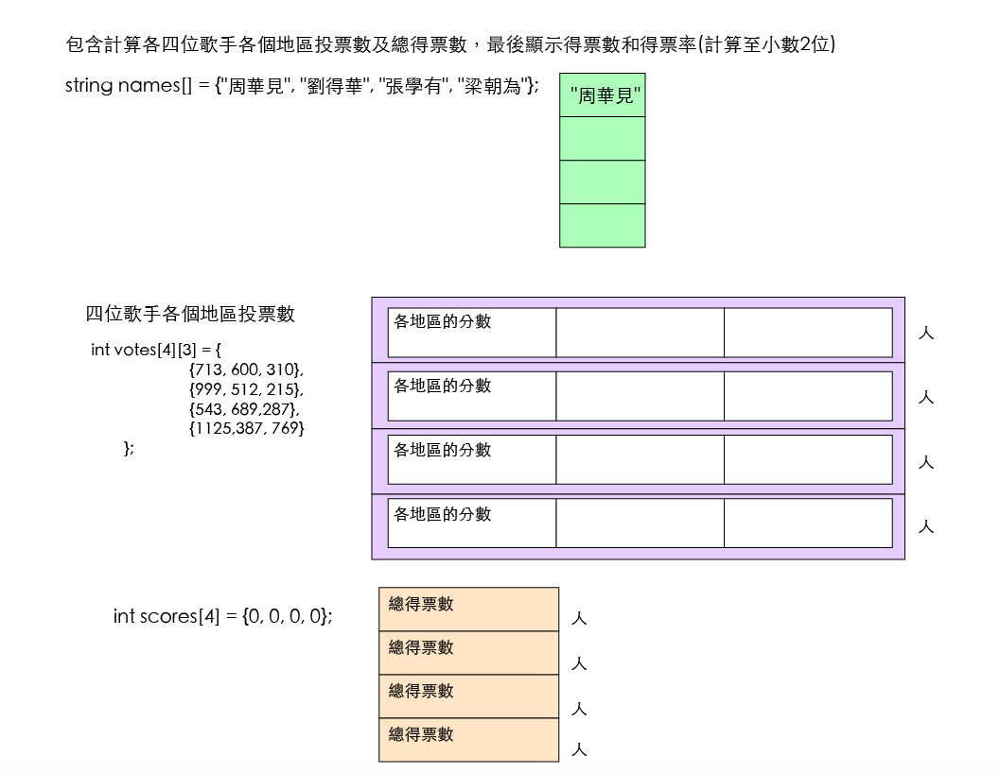

# 陣列
## 一維陣列初值設定
```
資料型別 陣列名稱[陣列長度 n];
陣列名稱[0] = 值1;
陣列名稱[1] = 值2;
........

int number[10];    // 宣告 10 個元素的整數陣列
double score[10];  // 宣告 10 個元素的浮點數陣列
char ascii[10];    // 宣告 10 個元素的字元陣列
```

```c++
// Name        : array1.cpp
//建立陣列語法

#include <iostream>
using namespace std;

int main() {
	int scores[3];
	scores[0] = 70;
	scores[1] = 80;
	scores[2] = 90;
	cout << scores[0] << "," << scores[1] << "," << scores[2];
	return 0;
}
```

### 宣告陣列變數同時設定各元素初始值的語法為:

```
資料型別 陣列名稱[n] = {值1,值2,值3,......,值n}
```

```c++
// Name        : array2.cpp
//建立陣列語法
//宣告時同時給值
//============================================================
70,80,90
//============================================================


#include <iostream>
using namespace std;

int main() {
	
	int scores[3] = {70, 80, 90};
	cout << scores[0] << "," << scores[1] << "," << scores[2];
	return 0;
}
```

```c++
*問題 fruit_s.cpp
建立一個包含三個元素的字串陣列並設定初始值，代表個人的三種最喜愛的水果名稱，再依序顯示:

顯示=========
我喜歡的第一種水果:xxx
我喜歡的第二種水果:xxx
我喜歡的第三種水果:xxxx
```
[解題](https://repl.it/@roberthsu2003/fruits)

### 使用迴圈設定陣列
	
```c++
// Name        : score1.cpp
//建立一個包含五個元素的整數陣列，讓使用者輸入五位學生的成績，然後計算班級總成績及平均成績
//============================================================
請輸入第1位學的成績78
請輸入第2位學的成績89
請輸入第3位學的成績67
請輸入第4位學的成績90
請輸入第5位學的成績89
全班總成績為:413分,平均為82.6分
//============================================================


#include <iostream>
using namespace std;

int main() {
	const int nums = 5;
	int scores[nums];
	int sum=0;
	double ave;
	for(int i=0;i<nums;i++){
		cout << "請輸入第" << i+1 << "位學的成績";
		cin >> scores[i];
	}

	for(int i=0; i<nums; i++){
		sum += scores[i];
	}

	ave = (double)sum / nums;

	cout << "全班總成績為:" << sum << "分,平均為" << ave << "分\n";
	return 0;
}
```

### 

 ```c++
//========================================================================
//Name        : score2.c
//建立一個包含五個元素的整數陣列，讓使用者輸入五位學生的成績，然後計算班級總成績及平均成績
//使用c的語法
//============================================================
請輸入第0位學的成績78
請輸入第1位學的成績90
請輸入第2位學的成績79
請輸入第3位學的成績89
請輸入第4位學的成績94
全班總成績為:430分,平均為86.00分
//============================================================


#include <stdio.h>
#include <stdlib.h>

int main(void) {
	const int nums = 5;
		int scores[nums];
		int sum=0;
		double ave;
		for(int i=0;i<nums;i++){
			//cout << "請輸入第" << i+1 << "位學的成績";
			//cin >> scores[i];
			printf("請輸入第%d位學的成績",i);
			scanf("%d",&scores[i]);
		}

		for(int i=0; i<nums; i++){
			sum += scores[i];
		}

		ave = (double)sum / nums;

		//cout << "全班總成績為:" << sum << "分,平均為" << ave << "分\n";
		printf("全班總成績為:%d分,平均為%.2f分\n",sum,ave);
	return EXIT_SUCCESS;
}
```

```c++
*問題 sale_s.cpp
小英是百貨公司結帳員,請您為她設計一個程式，先輸入客戶購買的貨品件數，再依此件數宣告陣列來儲存貨品價格，最後計算全部貨品總價

顯示=======
請輸入購買貨品件數:4
請輸入第1件貨品的價格:xxx
請輸入第2件貨品的價格:xxx
請輸入第3件貨品的價格:xxx
請輸入第4件貨品的價格:xxx
全部貨品總價為:xxxxx元
```

[解題](https://repl.it/@roberthsu2003/sales)

```
*問題 min.cpp
試使用陣列配合for迴圈，找尋陣列中最小值的程式，程式執行時會要求將輸入數值的數量，輸入完畢會顯示所輸入數值中的最小值

//=====================================================================
請輸入數值:4
請輸入第1數值:4
請輸入第2數值:5
請輸入第3數值:6
請輸入第4數值:7
4 | 5 | 6 | 7 | 最小值是:4
//=====================================================================
```

[解題](https://repl.it/@roberthsu2003/min)


### 一維陣列空間大小
```c++
// Name        : sizeof.cpp
//建立一個包含五個元素的整數陣列,使用sizeof計算陣列元素的個數,再使用for迴圈顯示陣列內容。
//============================================================

陣列的大小為:20,一個元素的大小是4,陣列的數量是5

//============================================================


#include <iostream>
using namespace std;

int main() {
	int n[]={1,3,5,7,9};
	int totalSize = sizeof(n);
	int oneSize = sizeof(n[0]);
	int counts = totalSize / oneSize;
	cout << "陣列的大小為:" << totalSize << ",一個元素的大小是" << oneSize << ",陣列的數量是" << counts;
	return 0;
}
```


### 陣列的應用:泡沫排序

```c++
// Name        : bubble.cpp
//任由使用者輸入任意個數的數值序列,程式會將此數值序列由小到大排序後顯示
//============================================================

請輸入要排序的數值個數:5
請輸入第1個數值:45
請輸入第2個數值:78
請輸入第3個數值:24
請輸入第4個數值:69
請輸入第5個數值:91
排序前:
45 78 24 69 91
排序後:
24 45 69 78 91

//============================================================


#include <iostream>
using namespace std;

int main() {
	int nums;
	cout << "請輸入要排序的數值個數:";
	cin >> nums;
	float array[nums],temp;

	for(int i=0; i<nums; i++){
		cout << "請輸入第" << i+1 << "個數值:";
		cin >> array[i];
	}

	cout << "排序前:\n";
	for (int i=0; i < nums; i++){
		cout << array[i] << " ";
	}

	//陣列排序
	for(int i=0; i < nums-1; i++){
		for(int j=i+1; j < nums; j++){
			if (array[i] > array[j]){
				temp = array[i];
				array[i] = array[j];
				array[j] = temp;
			}
		}
	}

	cout << "\n";
	cout << "排序後:\n";
		for (int i=0; i < nums; i++){
			cout << array[i] << " ";
		}

	return 0;
}
```

```c++
*問題 bubble_s.cpp
由大到小的排序

顯示==========
排序前數值序列:
20 45 98 23 85
由大到小的排序後:
98 85 45 23 20
```
[解題](https://repl.it/@roberthsu2003/bubbles)

### 陣列的應用:循序搜尋

```c++
// Name        : sequential.cpp
//百貨公司舉辦週年抽獎活動，將顧客的抽獎編號及姓名分別儲存於陣列中，使用者輸入編號，程式會搜尋出該編號的姓名並顯示。若查詢不到也會顯示無此編號的訊息

//============================================================

請輸入中獎者的編號943
中獎者的姓名為:stu3(共比對3次)

//============================================================

#include <iostream>
using namespace std;

int main() {
	int nums[] = {256, 731, 943, 389, 142, 645, 829, 945, 371, 418};
	string names[] = {"stu1","stu2","stu3","stu4","stu5","stu6","stu7","stu8","stu9","stu10"};
	int inputNum;
	int i;
	int n = sizeof(nums) / sizeof(nums[0]);
	bool isfound = false;
	cout << "請輸入中獎者的編號";
	cin >> inputNum;
	for(i=0; i<n ; i++){
		if(nums[i] == inputNum){
			isfound = true;
			break;
		}
	}

	if(isfound == true){
		cout << "中獎者的姓名為:" << names[i];
	}else{
		cout << "無此中獎號碼!";
	}

	cout << "(共比對" << i+1 << "次)\n\n";
	return 0;
}
```

### 二分搜尋法

```c++
//============================================================================
// Name        : binary.cpp
//使用2分搜尋法執行搜尋

//============================================================

排序後的編號:
142 256 371 389 418 645 731 829 943 945
請輸入中獎者的編號:418
中獎者的姓名為:林小10(共比對1次)

//============================================================


#include <iostream>
using namespace std;

int main() {
	int num[] = {256, 731, 943, 389, 142, 645, 829, 945, 371, 418};
	string name[] = {"林小1","林小2","林小3","林小4","林小5","林小6","林小7","林小8","林小9","林小10"};
	int n = sizeof(num) / sizeof(num[0]);
	int s, i ,j , c, min, max, mid;
	bool isFound;
	int tempInt;
	string tempstr;
	for (i=0; i < n-1; i++){
		for(j = i+1; j<n; j++){
			if(num[i] > num[j]){
				tempInt = num[i];
				num[i] = num[j];
				num[j] = tempInt;

				tempstr = name[i];
				name[i] = name[j];
				name[j] = tempstr;

			}
		}
	}

	cout << "排序後的編號:\n";
	for(i = 0; i<n ; i++){
		cout << num[i] << " ";
	}

	for(;;){
		isFound = false;
		min = 0;
		max = n-1;
		c=1;
		cout << "\n請輸入中獎者的編號:";
		cin >> s;
		while(min <= max){
			mid = (min+max)/2;
			if(num[mid] == s){
				isFound = true;
				break;
			}
			c++;
			if(num[mid] > s){
				max = mid - 1;
			}else{
				min = mid + 1;
			}
		}

		if(isFound == true){
			cout << "中獎者的姓名為:" << name[mid];
			cout << "(共比對" << c << "次)\n\n";
			break;
		}else{
			cout << "無此中獎號碼!";
			cout << "(共比對" << c << "次)\n\n";
		}

	}
	return 0;
}
```

```
*問題 binary_s.cpp
建立整數陣列int num[] = {67, 12, 9, 52, 91, 3}, 讓使用者輸入一個整數，以二分搜尋方法檢查該整數是否存在於陣列中，並顯示查詢結果。
```

### 一維字元陣列
```
在c++中，使用字串，可以使用string型別和char字元型別。
string str = "DevC++";
char str[] = {'D', 'e', 'v', 'C', '+', '+'};
//利用字串初始化
char str[] = "DevC++";
```
 
```c++
// Name        : str1.cpp
// Author      : 
// Version     :
// Copyright   : Your copyright notice
// Description : Hello World in C++, Ansi-style
//============================================================================
//============================================================

str1:DevC++
str2:DevC++
str3:DevC++
str1:VirturlC++

//============================================================

#include <iostream>
using namespace std;

int main() {
	string str1 = "DevC++";
	cout << "str1:" << str1 << endl;
	char str2[] = {'D','e','v','C','+','+','\0'};
	cout << "str2:" << str2 << endl;
	char str3[] = "DevC++";
	cout << "str3:" << str3 << endl;

	str1 = "VirturlC++";
	cout << "str1:" << str1 << endl;

	//str2 = "VirturlC++"; //錯誤
	return 0;
}
```
 

### 多維陣列
```
資料型別 變數名稱[引數1][引數2]

500個學生的學號及10科成績如下:
int score[500][10]
```

```
二維陣列分值設定
資料型別 陣列名稱[n1][n2];
陣列名稱[0][0] = 值1;
陣列名稱[0][1] = 值2;
-------------------------
陣列名稱[n1-1][n2-1] = 值n

```

```c++
//============================================================================
// Name        : initial2.cpp
//建立一個2*3的二維陣列並初始化，用來儲存2個學生各三科成績，再以2層巢狀迴圈將所有成績顯示出來。

//============================================================

第1位學生第1科成績:85
第1位學生第2科成績:82
第1位學生第3科成績:90
================================================
第2位學生第1科成績:76
第2位學生第2科成績:95
第2位學生第3科成績:89
================================================

//============================================================


#include <iostream>
using namespace std;

int main() {
	int score[2][3] = {{85, 82, 90},{76, 95, 89}};
	for(int i=0; i<2; i++){
		for(int j=0; j<3;j++){
			cout << "第" << i+1 << "位學生第" << j+1 << "科成績:" << score[i][j] << endl;
		}

		cout << "================================================\n";
	}
	return 0;
}
```

	
### 二維陣列

```c++
//============================================================================
// Name        : vote.cpp
//設計一個投票統計表，包含計算各四位歌手3個地區投票數及總得票數，最後顯示得票數和得票率(計算至小數2位)

//============================================================

names[0]:周華見
names[1]:劉得華
names[2]:張學有
names[3]:梁朝為
周華見總票數為:1623
周華見得票率為22.7025%

劉得華總票數為:1726
劉得華得票率為24.1432%

張學有總票數為:1519
張學有得票率為21.2477%

梁朝為總票數為:2281
梁朝為得票率為31.9066%

//============================================================


#include <iostream>
using namespace std;

int main() {
	string names[] = {"周華見", "劉得華", "張學有", "梁朝為"};
	int namesCount = sizeof(names) / sizeof(names[0]);
	for (int i=0; i<namesCount; i++){
		cout << "names" << "[" << i << "]:" << names[i] << endl;
	}

	int votes[4][3] = {
			{713, 600, 310},
			{999, 512, 215},
			{543, 689,287},
			{1125,387, 769}
	};

	int scores[4] = {0, 0, 0, 0};
	float totalScores = 0;
	for(int i=0; i<namesCount;i++){
		for(int j=0; j<3; j++){
			scores[i] += votes[i][j];

		}

		totalScores += scores[i];
	}
	for (int i=0; i<namesCount; i++){
		cout << names[i] << "總票數為:" << scores[i] << endl;
		cout << names[i] << "得票率為" << scores[i] / totalScores * 100 << "%" << "\n\n";
	}


	return 0;
}
```

###  
```c++
//============================================================================
// Name        : biglottery.cpp
//撰寫一個大樂透電腦自動選號程式，程式執行會以亂數的方式顯示1-49之間七個不重複的大樂透號碼。

//============================================================

本期大樂透電腦選號號碼如下:

2 28 8 42 49 20 15

特別號:15

//============================================================

#include <iostream>
#include <stdlib.h>
#include <time.h>

using namespace std;

int main() {
	int lot[49];
	int choose[7];
	int num = 7;
	int maxIndex = 48;

	for(int i=0;i<49;i++){
		lot[i] = i+1;		
	}
	srand(time(NULL));
	for(int i=0;i<7;i++){
		int randIndex = rand()%(maxIndex+1);
		choose[i] = lot[randIndex];
		lot[randIndex] = lot[maxIndex];
		maxIndex--;
	}

	cout << "本期大樂透電腦選號號碼如下:\n\n";
	for(int i=0; i<num; i++){
		cout << choose[i] << " ";
	}
	cout << "\n\n特別號" << choose[6] << "\n\n";


}
```

```
*問題 ninenine.cpp
以程式建立 9 x 9 的二維整數陣列，陣列內容是九九乘法表的乘積，並將之輸出

顯示==========
1*1=1   1*2=2   1*3=3   1*4=4   1*5=5   1*6=6   1*7=7   1*8=8   1*9=9
2*1=2   2*2=4   2*3=6   2*4=8   2*5=10  2*6=12  2*7=14  2*8=16  2*9=18
3*1=3   3*2=6   3*3=9   3*4=12  3*5=15  3*6=18  3*7=21  3*8=24  3*9=27
4*1=4   4*2=8   4*3=12  4*4=16  4*5=20  4*6=24  4*7=28  4*8=32  4*9=36
5*1=5   5*2=10  5*3=15  5*4=20  5*5=25  5*6=30  5*7=35  5*8=40  5*9=45
6*1=6   6*2=12  6*3=18  6*4=24  6*5=30  6*6=36  6*7=42  6*8=48  6*9=54
7*1=7   7*2=14  7*3=21  7*4=28  7*5=35  7*6=42  7*7=49  7*8=56  7*9=63
8*1=8   8*2=16  8*3=24  8*4=32  8*5=40  8*6=48  8*7=56  8*8=64  8*9=72
9*1=9   9*2=18  9*3=27  9*4=36  9*5=45  9*6=54  9*7=63  9*8=72  9*9=81
```
[解題](https://repl.it/@roberthsu2003/ninenine)


```
*問題 sorted.cpp
建立一個長度為10的一維整數陣列，可以供使用者輸入10個數字後，並由小到大排序輸出。

//顯示=======================================
```
[解題](https://repl.it/@roberthsu2003/sorted)


```
*問題 ageSorted.cpp
建立一個姓名陣列及一個同樣長度的年齡陣列，使用者可以依選項選擇將年齡由小到大，或由大到小排序，並搭配姓名輸出
string names[] = {"老李", "王種", "發叔", "龍哥" ,"小陳" ,"小張"};
int ages[] = {56, 45, 51, 48, 35, 57};

顯示==========
尚未排序前:
老李    王種    發叔    龍哥    小陳    小張
56     45     51     48      35     57


1.由小到大排序      2.由大到小排序
請輸入選項:1

由小到大排序後:
小陳    王種    龍哥    發叔    老李    小張
35     45     48      51     56     57
```
[解題](https://repl.it/@roberthsu2003/ageSorted)
