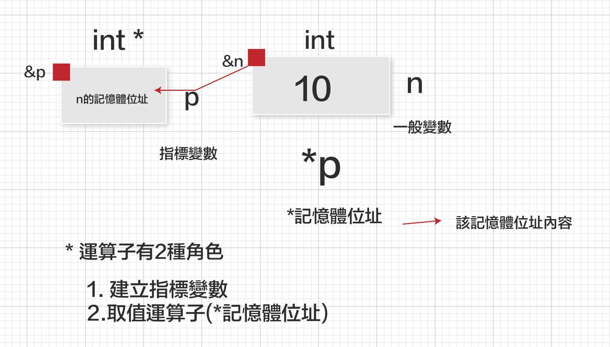
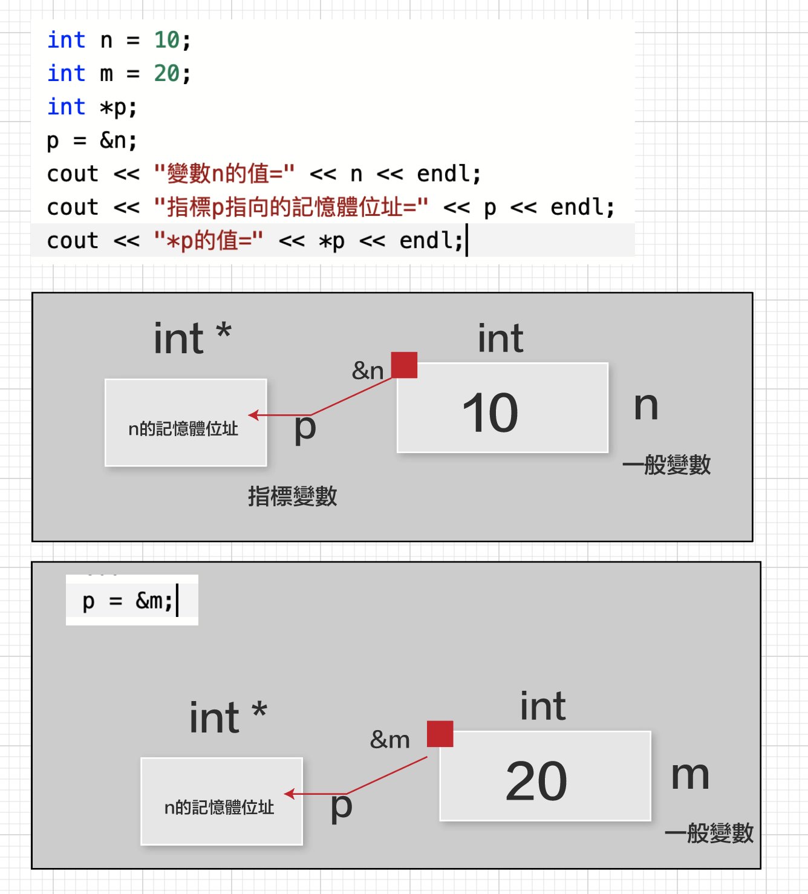
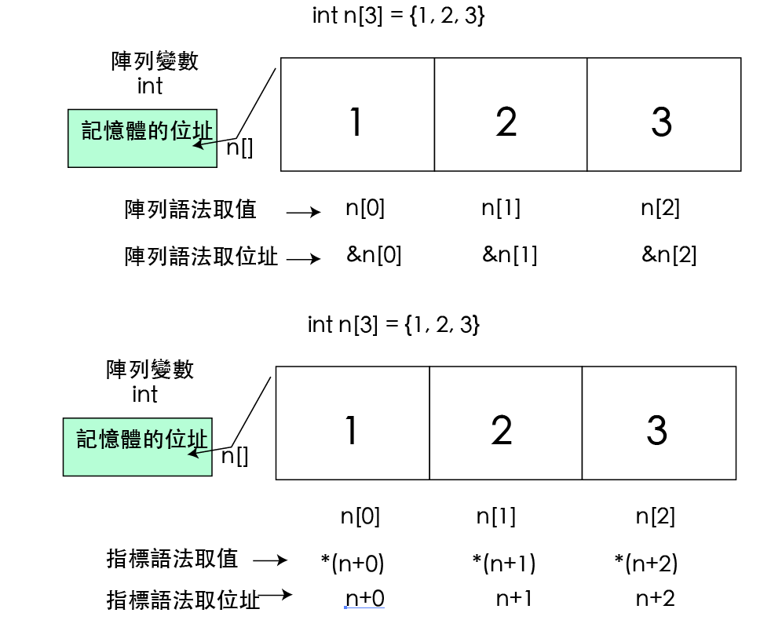
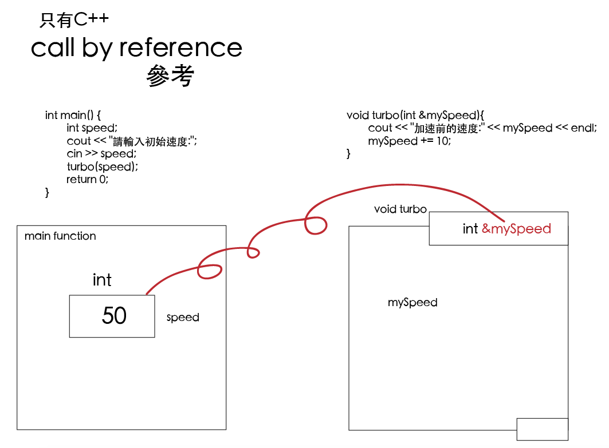
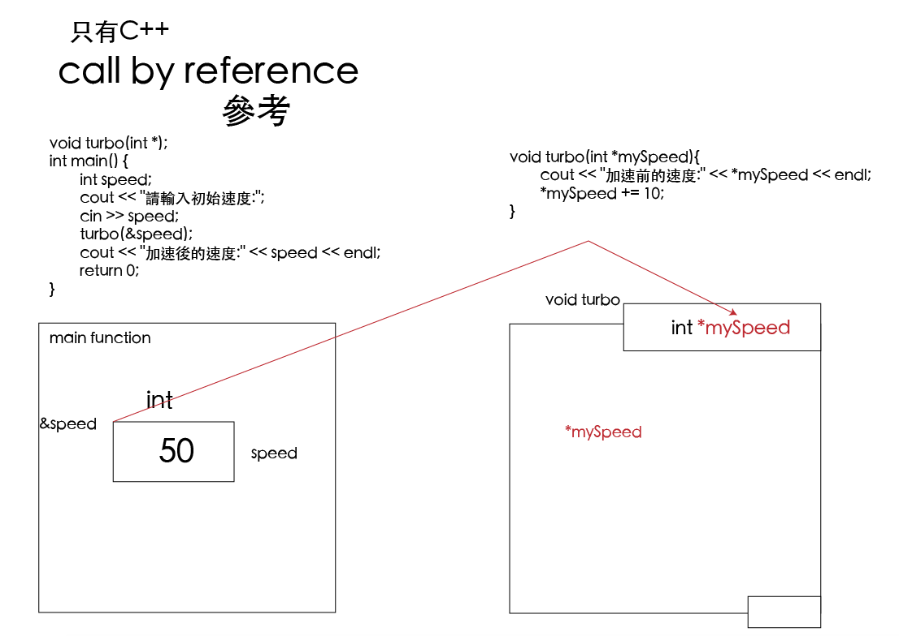

# 指標
## & 取運算子

```
&變數名稱
```
	//============================================================================
	// Name        : Pointer.cpp
	//宣告變數 double m=5, int n = 10, 顯示變數m,n的值，位址和記憶體大小。
	
	#include <iostream>
	using namespace std;
	
	int main() {
		double m = 5;
		int n = 10;
		cout << "變數m的值=" << m << endl;
		cout << "變數n的值=" << n << endl;
		cout << "變數m的位址" << &m << endl;
		cout << "變數n的位址" << &n << endl;
		cout << "變數m的記憶體=" << sizeof(m) << "Bytes" << endl;
		cout << "變數n的記憶體=" << sizeof(n) << "Bytes" << endl;
		return 0;
	}

### 

	//============================================================================
	// Name        : pointer2.cpp
	//顯示陣列的位址。宣告陣列 int n[3] = {1, 2, 3}，顯示陣列元素的位址。
	
	
	#include <iostream>
	using namespace std;
	
	int main() {
		int n[3] = {1, 2, 3};
		cout << "陣列n的位址=" << n << endl;
		cout << "陣列元素n[0]的位址=" << &n[0] << endl;
		cout << "陣列元素n[1]的位址=" << &n[1] << endl;
		cout << "陣列元素n[2]的位址=" << &n[2] << endl;
	
		return 0;
	}

```
*question 顯示變數n的值和位址 number.cpp
輸入變數n的值後，顯示此變數的值和存放的位址

顯示=============================
請輸入變數 n = 12
變數 n 的值=12
變數 n 的位址=0x7ffeef0805a0
```

## 指標
指標儲存的內容是記憶體位址

```
指標變數的宣告
資料型別 *指標變數;
int *p;
```

```
指標變數的宣告和指向其它變數的位址
資料型別 *指標變數;
資料型別 *指標變數 = &變數名稱
int n = 10;
int *p = &n;
```

	//============================================================================
	// Name        : pointer3.cpp
	// 指標。以指標顯示變數n的位址和內容
	
	#include <iostream>
	using namespace std;
	
	int main() {
		int n=10;
		int *p = &n;
		cout << "變數n的值=" << n << endl;
		cout << "變數n的位址=" << &n << endl;
		cout << "指標p的值是=" << p << endl;
		cout << "指標p的記憶體位址是=" << &p << endl;
		cout << "指標p指向的值是;" << *p << endl;
		return 0;
	}
	
###

	//============================================================================
	// Name        : pointer4.cpp
	//宣告n=10,指標p指向n的位址，以指標p存取記憶體的內容

	#include <iostream>
	using namespace std;

	int main() {
		int n=10;
		int *p;
		p = &n;
		cout << "n=" << n << endl;
		cout << "&n=" << &n << endl;
		cout << "p=" << p << endl;
		cout << "*p=" << *p << endl;
		cout << "*&n=" << *&n << endl;
		return 0;
	}

```
「*」有2個不同的用途，可以宣告指標變數，也可以當作取用，雖然用法相同，但意義是不一樣
「int *p」代表p是整數指標變數，所以p是另一個變數的位址。
「*記憶體位址」代表取得記憶體位址所儲存的內容，所以「*p」表示取得位址p所指向的儲存值。
```



### 

	//============================================================================
	// Name        : pointer5.cpp
	//改變指標變數的記憶體內容
	
	
	#include <iostream>
	using namespace std;
	
	int main() {
		int n = 10;
		int *p = &n;
		cout << "變數n的值=" << n << endl;
		cout << "指標p的指向的內容=" << *p << endl;
	
		*p = 20;
		cout << "改變後的變數n的值=" << n << endl;
		return 0;
	}
	
	
	

###
	//============================================================================
	// Name        : Pointer6.cpp
	//同一個指標可以改變指標的指向位址，則其存取的位址和記憶體內容也會不同

	#include <iostream>
	using namespace std;

	int main() {
		int n = 10;
		int m = 20;
		int *p;
		p = &n;
		cout << "變數n的值=" << n << endl;
		cout << "指標p指向的記憶體位址=" << p << endl;
		cout << "*p的值=" << *p << endl;
		cout << "-----------------------" << endl;

		p = &m;
		cout << "變數m的值=" << m << endl;
		cout << "指標p指向的記憶體位址=" << p << endl;
		cout << "*p的值=" << *p << endl;
		cout << "-----------------------" << endl;
		return 0;
	}



```
*question
輸入變數x,y的值，以指標將2數相加並顯示兩數相加的結果?


顯示===================
請輸入變數x=20
請輸入變數y=30
20 + 30 = 50

```
### 一維陣列與指標

```
要存取陣列元素語法有:
使用陣列變數語法
	使用陣列變數[索引]
使用指標變數的語法
2.*(指標變數名稱+索引)
```
```
int array[]={1,2,3};
cout << array[2];
cout << *(array+2);
```


	//============================================================================
	// Name        : p_array1.cpp
	//定義整數一維陣列，以陣列與指取得陣列位址和陣例元素內容

	#include <iostream>
	using namespace std;

	int main() {
	int n[3] = {1,2,3};
	cout << "陣列元素 \t\t 位      址 \t \t值 \n";
	cout << "-------------------------------------------\n";
	for(int i=0; i<3; i++){
		cout << "n[" << i << "]\t\t" << &n[i] << "\t\t" << n[i] << endl;
	}

	//以指標變數的語法
	cout << "陣列指標 \t\t 位      址 \t\t值 \n";
	cout << "-------------------------------------------\n";
	for(int i=0; i<3; i++){
		cout << "n+" << i << "\t\t" << n+i << "\t\t" << *(n+i) << endl;
	}

	return 0;
}

### 一維字元陣列與指標


	//============================================================================
	// Name        : p_array2.cpp
	// 定義一維字元陣列，分別以陣列與指標取陣列元素內容。


	#include <iostream>
	using namespace std;

	int main() {
		char *str1 = "One";
		char str2[] = "Two";
		cout << "以陣列顯示str1字串" << endl;
		for(int i=0; i < 3; i++){
			cout << "str1[" << i << "]=" << str1[i] << endl;
		}

		cout << "以指標變數顯示str1字串" << endl;
		for(int i=0; i < 3; i++){
			cout << "(str2 + " << i << ")=" << *(str2+i) << endl;
		}
		str1=str2;
		//str2 = str1;
		return 0;
	}


```
*question 陣列與指標的存取
宣告int n[] = {1,2,3}，分別利用陣列和指標求陣列元素的總和。


顯示==================
以陣列元素求總和
總和 total = 6
以指標求總和
總和 tot2 = 6
```


### 
	//============================================================================
	// Name        : callByRef1.cpp
	// Author      : 傳參考呼叫

	#include <iostream>
	using namespace std;
	void  turbo(int &);
	int main() {
		int speed;
		cout << "請輸入初始速度:";
		cin >> speed;

		turbo(speed);
		cout << "加速後速度:" << speed << endl;

		return 0;
	}

	void turbo(int &mySpeed){
		cout << "加整前速度:" << mySpeed << endl;
		mySpeed+=10;
	}




	//============================================================================
	// Name        : callByAddress1.cpp
	//call by address
	
	#include <iostream>
	using namespace std;
	
	void turbo(int *);
	int main() {
		int speed;
		cout << "請輸入初始速度:";
		cin >> speed;
		turbo(&speed);
		cout << "加速後的速度:" << speed << endl;
		return 0;
	}
	
	void turbo(int *mySpeed){
		cout << "加速前的速度:" << *mySpeed << endl;
		*mySpeed += 10;
	}
	



	//============================================================================
	// Name        : array21.cpp
	//陣列變數當作參數,或指標變數當作參數
	
	#include <iostream>
	using namespace std;
	void showAry(int *);
	void sub2(int *);
	int main() {
		int ary[] = {1, 2, 3};
		cout << "1指標變數當參數:" << endl;
		showAry(ary);
	
		cout << "2陣列變數當參數" << endl;
		sub2(ary);
	
		showAry(ary);
		return 0;
	}
	
	void showAry(int *tempAry){
		for(int i=0; i<=2; i++){
			cout << "ary[" << i << "]=" << tempAry[i] << "\t";
			cout << "\n-----------------------------" << endl;
		}
	}
	
	void sub2(int tempAry[]){
	 for(int i=0; i<=2; i++){
		 tempAry[i] *= 2;
	 }
	}

### 指標的應用


	
