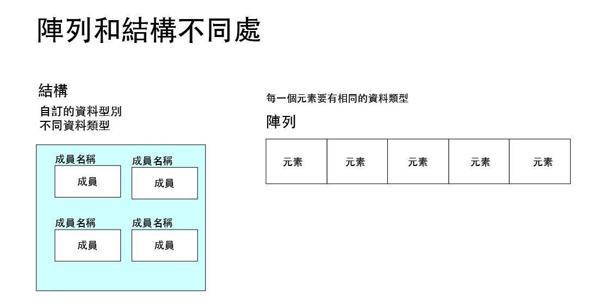

#物件與類別
### 結構



```
定義結構的語法:
struct 結構名稱{
	資料型別 成員變數1;
	資料型別 成員變數1;
	資料型別 成員變數1;
}

例如:
struct student{
	int id;
	char *name;
	int chinese,math,english;
};
```

```
建立結構變數
struct 結構名稱 結構變數;

例如:
struct student david;
david.id = 99001;
david.name=”robert;”
david.chinese = 75;
david.math = 86;
david.english = 90;
```

```
宣告結構變數David時，同時初始化
struct Student david = {99001, "robert", 75, 86, 90};
```

#### 定義結構時同時建立結構變數
```
struct 結構名稱{
	資料型別 成員變數1;
	資料型別 成員變數1;
	資料型別 成員變數1;
}結構變數1,結構變數2;

```

#### 結構成員的存取
```
使用「.」運算子存取
struct Student david = {99001, "robert", 75, 86, 90};
david.name
david.chinese
david.math
david.english
```


	//============================================================================
	// Name        : struct1.cpp
	//結構的宣告與結構存取
	
	
	#include <iostream>
	using namespace std;
	
	//宣告(定義)結構
	struct Student{
		char name[8];
		int score;
	};
	
	int main() {
		//建立結構實體
		struct Student david = {"David", 90};
		cout << "姓名" << "\t" << "成績" << endl;
		cout << david.name << "\t" << david.score;
		return 0;
	}


### 

	//============================================================================
	// Name        : Rectangle1.cpp
	//宣告Rectangle結構，並建立結構變數Height,Width表示長和寬，輸入矩形的長和寬後計算面積
	
	
	#include <iostream>
	using namespace std;
	struct Rectangle{
		int width;
		int height;
	};
	
	int main() {
		struct Rectangle rec = {0,0};
		cout << "請輸入width:";
		cin >> rec.width;
		cout << "請輸入height:";
		cin >> rec.height;
	
		cout << "矩形的面績是:" << rec.width * rec.height << endl;
		return 0;
	}

## 物件與類別
```
class 類別名稱{
	private:
		[static] 資料型別 成員;
	public:
		[static] 資料型別 成員;
	protected:
		[static] 資料型別 成員;
};
```

	//============================================================================  
	// Name        : FirstClass1.cpp  
	//自行定義的類別
	
	
	using namespace std;
	//定義class
	class Person{
		public:
		int tall;
		string name;
		void walk(int var){
			cout << name << "每小時可跑" << var << "公里" << endl;
		}

	};


	int main() {
		Person david;
		david.tall = 180;
		david.name = "David";
		cout << david.name << " 身高=" << david.tall << endl ;
		david.walk(15);

		Person robert;
		robert.tall = 183;
		robert.name = "Robert";
		cout << robert.name << " 身高=" << robert.tall << endl;
		robert.walk(20);
		return 0;
	}
	
### 在類別的外部定義方法  
	
```
	可以將方法定義在類別的內部，也可以將方法定義在類別的外部。此時就必須在類別中加入方法原型宣告，並在類別外部的方法前加上「::」類別範圍解析子。例如「Person::walk」;
```
	
	//============================================================================
	// Name        : protClass1.cpp
	// 在類別的外部定義方法
	
	#include <iostream>
	using namespace std;
	
	class Person{
		public:
			int tall;
			string name;
			void walk(int);
	};
	
	void Person::walk(int var){
				cout << name << "每小時可跑" << var << " 公里" << endl;
	}
	
	int main() {
		Person david;
		david.tall = 183;
		david.name = "David";
		cout << david.name << " 身高=" << david.tall << endl;
		david.walk(20);	
		return 0;
	}


### 方法
方法(method)其實就是函式，在類別中有將函式稱為方罄，方法會執行指定的動作，可以傳回或不傳回返回值，在呼叫方法的過程鄉可以傳遞參數或不傳遞參數

```
加上static 關鍵字宣告的方法，即為靜態方法。省略static宣告的方法，則為實體方法。
```

	//============================================================================
	// Name        : method1.cpp
	//建立方法,設定一個Turbo()方法，可以將speed的屬性加1
	
	#include <iostream>
	using namespace std;
	
	class Car{
		public:
			int speed;
			void turbo(){
				this -> speed = this -> speed+1;
			}
	};
	
	
	int main() {
		Car BMW;
		BMW.speed = 70;
		cout << "現在速度=" << BMW.speed << endl;
		BMW.turbo();
		cout << "現在速度=" << BMW.speed << endl;
		return 0;
	}

### public 欄位的保護
物件的另一個特點是封裝，封裝是為了保護物件，避免物件因為外界不正當的存取而破壞。使用自訂的方法對資料成員作保護。如此可以保護物件的正當存取。


	//============================================================================
	// Name        : speed2.cpp
	// 使用private 保護欄位
	
	
	#include <iostream>
	using namespace std;
	
	class Car{
		private:
		 int speed;
	
		public:
			void turbo(){
				this -> speed = this -> speed+1;
			}
	
			void setSpeed(int var){
				if(var < 60){
					speed = 60;
				}else if (var > 100){
					speed = 100;
				}else{
					speed = var;
				}
	
			}
	
			int getSpeed(){
				return speed;
			}
	};
	
	
	int main() {
		Car BMW;
		BMW.setSpeed(58);
		cout << "現在速度=" << BMW.getSpeed()<< endl;
		BMW.turbo();
		cout << "現在速度=" << BMW.getSpeed() << endl;
		return 0;
	}

```
*question 自行定義類別
定義Circle類別,並建立Radius欄位表示半徑，Area()方法計算圓面積。輸入半徑後計算圓面積

顯示================
半徑 = 10
圓面積=314.159
```

### 建構式
類別中有一個特殊的方法，稱為建構式，其名稱和類別相同。
當使用者建立新的學件時，會自動執行此建構式。
建構式常來做為物件的初始化動作

	//============================================================================
	// Name        : new1.cpp
	// 建構式
	
	
	#include <iostream>
	using namespace std;
	class Car{
		public:
			int speed;
			Car(){
				this->speed = 70;
			}
	
			Car(int n){
				this->speed = n;
			}
	};
	
	
	
	int main() {
		Car BMW;
		cout << "執行Car BMW建立物件後，速度=" << BMW.speed << endl;
	
		Car BMW1(95);
		cout << "執行Car BMW2建立物件後，速度=" << BMW1.speed << endl;
	
		return 0;
	}


### 實作.h 和 .cpp
建立h檔和cpp檔整合的class  

	/*
	 * Person.h
	 *
	 *  Created on: 2019年7月20日
	 *      Author: t1
	 */
	
	#ifndef PERSON_H_
	#define PERSON_H_
	
	#include <iostream>
	using namespace std;
	
	class Person{
		public:
			int tall;
			string name;
			void walk(int);
	};
	
	#endif /* PERSON_H_ */
	
### 

	/*
	* Person.cpp
	*/
	
	#include "Person.h"
	
	void Person::walk(int var){
				cout << name << "每小時可跑" << var << " 公里" << endl;
	}
	


### 
	//============================================================================
	// Name        : protClass1.cpp
	// 使用外部class
	
	
	
	#include "Person.h"
	
	int main() {
		Person david;
		david.tall = 183;
		david.name = "David";
		cout << david.name << " 身高=" << david.tall << endl;
		david.walk(20);
		return 0;
	}

	

//實作arduino https://single9.github.io/arduino/arduino_basic.html
